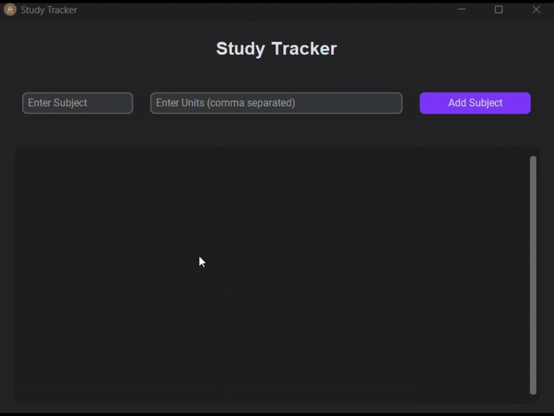

# 📚 Study Tracker

A simple **Study Tracker App** built with [CustomTkinter](https://github.com/TomSchimansky/CustomTkinter) (modern Tkinter) and Python.  
This app helps you manage subjects, units, and track your study progress with checkboxes.  
All data is saved locally in `study_data.json`, so you don’t lose progress when you close the app.

---

## ✨ Features
- ➕ Add subjects with multiple units (comma-separated).
- ✅ Mark units as completed with checkboxes.
- 🗑️ Delete subjects when no longer needed.
- 💾 Auto-save progress in a JSON file.
- 🌙 Dark, modern UI with **CustomTkinter**.
- 🔄 Restores your progress when you reopen the app.

---


## 🎥 Preview




---

## 🚀 Installation & Usage

1. **Clone the repository:**
   ```bash
   git clone https://github.com/imgauravmeena/study-tracker.git
   cd study-tracker

2. **Install required packages:**
   ```bash
   pip install customtkinter pillow 

3. **Run the App**

Thank you and peace out ✌️  
**Siuuu!!**  
**– Gaurav Meena**
